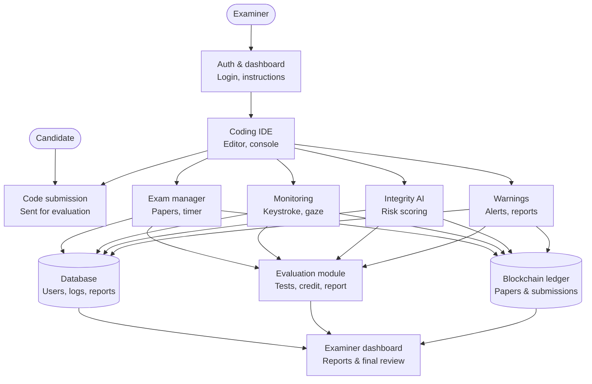

# sentri-code

**AI-Powered Coding Exam Platform with Behavioral Proctoring**

SentriCode is a browser-based coding examination platform that gives candidates a practical programming environment while protecting academic integrity during online assessments. It combines a reference-enabled coding IDE, AI-based behavioral integrity analysis, automated evaluation, and a blockchain ledger for tamper-proof records.

> **Project status:** Planning phase (CSD 415 Project Phase I, Batch 2023-2027). Implementation has not started yet. This README describes the proposed design and will be updated as modules are built.

---

## Table of Contents

- [Overview](#overview)
- [Key Features](#key-features)
- [System Architecture](#system-architecture)
- [Module Description](#module-description)
- [Tech Stack](#tech-stack)
- [Project Roadmap](#project-roadmap)
- [Expected Deliverables](#expected-deliverables)
- [Sustainable Development Goals](#sustainable-development-goals)
- [Team](#team)
- [License](#license)

---

## Overview

Online coding exams are hard to run fairly. Candidates can copy-paste code, get outside help, or use AI code generators, while manual invigilation does not scale. At the same time, penalizing accidental actions (such as glancing away from the screen) is unfair to honest candidates.

SentriCode addresses this by:

- Providing an IDE with syntax highlighting, a built-in function and syntax reference panel, and controlled assistance, so candidates focus on logic rather than memorizing syntax.
- Monitoring multiple behavioral signals during the exam to compute an **integrity score**.
- Using a **progressive warning mechanism** instead of immediate penalties.
- Producing detailed **behavioral reports** so the examiner makes the final call.
- Storing question papers and submissions on a **blockchain** for transparency and tamper-proof record keeping.

## Key Features

- **Web-based coding IDE** with syntax highlighting, language references and function documentation
- **Randomized question papers**: multiple papers are uploaded and randomly assigned to candidates
- **Behavioral monitoring**: keystroke dynamics, code editing history, cursor movement, keyboard activity and gaze patterns
- **AI-generated code detection** as part of the integrity analysis
- **Integrity scoring** that separates normal behavior from suspicious activity
- **Progressive warnings** to candidates instead of instant penalties
- **Automated evaluation** with test cases and AI-assisted partial credit
- **Examiner dashboard** with behavioral reports and AI-code detection results for final review
- **Blockchain ledger** (Hyperledger Fabric) for hashed question papers and submissions

## System Architecture

The system has four layers: a frontend for the examiner and candidate, backend services, an evaluation module, and storage. Data flows from the coding IDE into the backend services, then into storage and evaluation, and finally to the examiner dashboard.

### Workflow

1. **Before the exam:** Question papers are uploaded and randomly assigned to candidates. Blockchain technology securely stores the examination records.
2. **During the exam:** Candidates code in the web IDE. The system monitors keystroke dynamics, code history, cursor movement, keyboard activity, gaze patterns and AI-generated code characteristics to compute an integrity score.
3. **After the exam:** Submissions are evaluated using automated test cases and AI-assisted partial credit analysis. The examiner receives behavioral reports and AI-code detection results to support the final evaluation.

## Module Description

| Module | Layer | Responsibility |
| --- | --- | --- |
| Auth & dashboard | Frontend | Login and exam instructions |
| Coding IDE | Frontend | Code editor and console with syntax highlighting and language references |
| Code submission | Frontend | Sends the candidate's code for evaluation |
| Exam manager | Backend service | Question papers and exam timer |
| Monitoring | Backend service | Keystroke, cursor and gaze tracking |
| Integrity AI | Backend service | Risk scoring and AI-generated code analysis |
| Warnings | Backend service | Progressive alerts and reports |
| Evaluation module | Evaluation | Test cases, partial credit and report generation |
| Database | Storage | Users, logs and reports |
| Blockchain ledger | Storage | Hashed question papers and submissions |
| Examiner dashboard | Frontend | Reports and final review |

## Tech Stack

| Area | Technologies |
| --- | --- |
| Development environments | Google Colab, Visual Studio Code |
| Frontend | React.js, HTML5, CSS3, JavaScript, Monaco Editor |
| Backend | Node.js, Express.js |
| Database | SQLite, PostgreSQL |
| AI / Machine Learning | TensorFlow / PyTorch / Scikit-learn |
| Computer Vision | OpenCV, MediaPipe |
| Blockchain | Hyperledger Fabric |

## Project Roadmap

| Month | Milestones |
| --- | --- |
| Jul 2026 | Project planning, literature review, architecture design, requirement analysis |
| Aug 2026 | Tech stack setup, database schema design, blockchain setup, environment configuration |
| Sep 2026 | Frontend IDE development, Monaco Editor integration, backend API setup, database implementation |
| Oct 2026 | Proctoring module, tracking logic, AI code analysis, initial testing |
| Nov 2026 | Blockchain integration, security implementation, privacy protocols, module testing |
| Dec 2026 | Test case generation, LLM integration, partial credit logic, system integration |
| Jan 2027 | System testing, performance optimisation, alpha testing, usability testing |
| Feb 2027 | Bug fixing, security auditing, documentation, presentation preparation |
| Mar 2027 | Final review, thesis documentation, final submission, presentation and viva |

## Expected Deliverables

By the end of the VIII semester:

- [x] Journal publication
- [x] App / web hosting
- [ ] Conference publication
- [ ] Patent publication
- [ ] Hardware product

## Sustainable Development Goals

- **SDG 4 (Quality Education):** improves the fairness, credibility and integrity of assessment in online education.
- **SDG 9 (Industry, Innovation and Infrastructure):** builds an AI- and blockchain-based digital examination infrastructure for secure, resilient academic systems.
- **SDG 11 (Sustainable Cities and Communities):** reduces dependence on physical examination infrastructure and enables reliable, remotely accessible assessment.

## Team

**Group 9**, S7 B.Tech CS3, Department of Computer Science and Engineering, SCMS School of Engineering and Technology (SSET)

| Name | Roll No. |
| --- | --- |
| Jubin Sibi | SCM23CS138 |
| Muneer S | SCM23CS176 |
| Navaneeth S | SCM23CS187 |
| Nikhil Ramesh | SCM23CS191 |

**Project Guide:** Dr. Varun G. Menon, Professor, Department of Computer Science and Engineering, SSET

## License

License to be decided. Add a `LICENSE` file to the repository before making it public.
